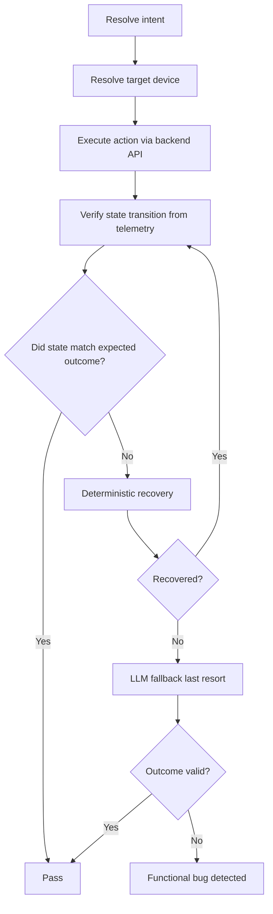
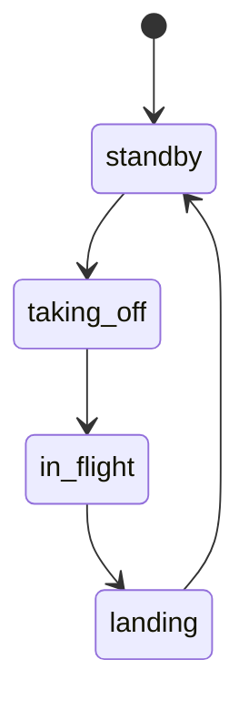

# FlytBase QA Agent Approach

## One-line summary

This project is not a browser “AI clicker.” It is a state-aware QA system that resolves intent, executes the correct action, verifies the real drone state transitions, performs deterministic recovery, and uses LLMs only as a last resort.

## Why this is different

Most hackathon QA demos use a generic AI model to click around a UI and decide whether something looks broken. That is useful for exploring a product, but it is not a testing system.

This project is different because it reasons about the real application contract:

- the simulator has a real flight state machine
- the backend exposes a command API
- the frontend publishes telemetry over socket events
- the QA agent verifies actual state transitions rather than guessed UI text
- recovery is deterministic and local before any AI is involved

This makes the system fundamentally closer to an enterprise QA engine than an LLM browser agent.

## The three-demo story

### Demo 1: normal pass

- Reset simulator
- Start the world
- Run takeoff test
- Verify drone reaches `in_flight`
- Terminal shows: `LLM calls: 0`
- Result: pass

### Demo 2: renamed control

- Rename button text from “Take off” to “Launch”
- Re-run the same test without changing the test logic
- The system detects the locator failure
- It tries alternate locators from the app map
- It finds the renamed button
- It verifies the drone really reaches `in_flight`
- Terminal shows: `LLM calls: 0` or `recovered from AppMap`
- Result: pass

### Demo 3: real functional bug

- Break the actual flight behavior so the drone never transitions
- The button still exists and the UI still looks alive
- The QA agent verifies the real telemetry and socket state
- It observes that altitude never rises and the drone never reaches `in_flight`
- It reports `FUNCTIONAL_BUG`
- It does not heal with a random AI guess
- Result: fail-by-system, not fail-by-locator

## Core architecture

### 1. Semantic discovery

The app map is discovered and stored as a structured contract. This informs the test agent what controls exist and what they mean.

Examples:

- `start_flight` intent maps to a takeoff action
- `land` intent maps to a landing action
- `in_flight` and `standby` are real state outcomes

This avoids brittle dependence on raw label text.

### 2. Target resolution

The system resolves the live drone ID from the real backend state instead of assuming `drone-1`.

This is essential because the simulator can have multiple drones, and the currently active device is dynamic.

### 3. Backend-first execution

The runner prefers the backend API over DOM clicks:

- command endpoint: `/api/control/command`
- backend validates the command against the simulator state

This is more reliable than clicking UI buttons, because it avoids stale or disabled states.

### 4. UI fallback only when needed

If the backend path is invalid or unavailable, the system falls back to the dashboard or cockpit UI.

This is still app-aware, because it uses semantic signals and alternative selectors instead of a blind “AI tries random clicks” loop.

### 5. Real verification

Verification is based on telemetry values, not just DOM text. The app exposes:

- flight status
- h-speed
- altitude
- socket connection state

The verifier accepts transient states like `taking_off` and `landing` as valid progress toward a final outcome.

This is crucial because the simulator does not jump from `standby` to `in_flight` instantly.

### 6. Deterministic recovery

If the first locator fails, the agent tries a deterministic sequence:

1. alternate selectors
2. alternate semantic target
3. correct live device
4. correct dashboard/cockpit surface
5. only then consider AI help

This ensures the system remains explainable and cost-efficient.

### 7. LLM last resort

The LLM is not used as the normal execution path. It is used only after deterministic recovery fails.

This is the key to the commercial story: the AI is a one-time learning cost, not a per-test-run operational cost.

## Simplified flow

## Actual simulator contract

The true state progression is:

This matters because the test must allow the app to live in intermediate states while it is transitioning.

A naive verifier that expects a single exact snapshot will misclassify valid progress as failure.

## Key files

- `simulator/src/drone.ts` — true flight state machine
- `backend/src/control/router.ts` — backend command API
- `frontend/src/components/TelemetryPanel.tsx` — telemetry contract used for verification
- `frontend/src/testids.ts` — DOM selectors used by the cockpit
- `qa-agent/src/executor/task-runner.ts` — orchestration logic for mission flow and demos
- `qa-agent/src/verification/verifier.ts` — state verification logic
- `qa-agent/src/recovery/deterministic-recovery.ts` — deterministic fallback

## Why this wins the hackathon story

The real difference is not that it can click a button. That is easy.

The difference is that it can tell the difference between:

- a control was renamed, but the system still works
- the app is actually broken, and the state never changes

That is a testing system, not a browser agent.

It also matches the commercial pitch:

- enterprise UI suites spend huge amounts on LLM API calls for every run
- this architecture makes AI a one-time learning layer, not a recurring runtime tax
- the system remains deterministic, explainable, and cost-aware

## Final takeaway

This project shows that AI should not be the default action executor for every test. Instead, AI should sit behind a deterministic app-aware QA engine. That is what makes the demo unique and judge-worthy.
